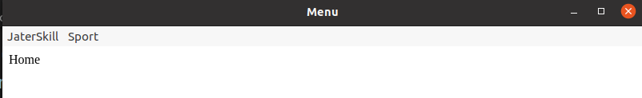
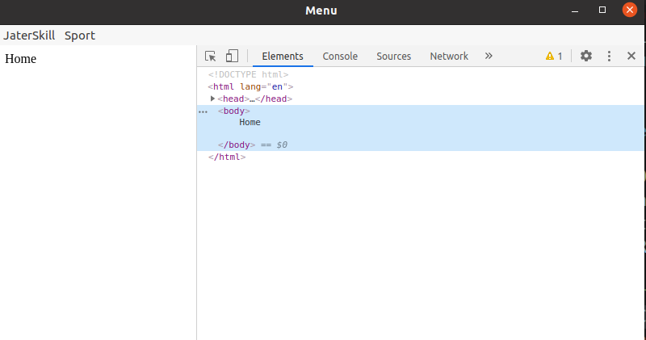
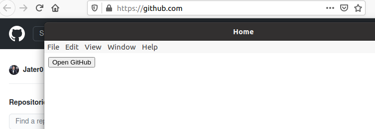
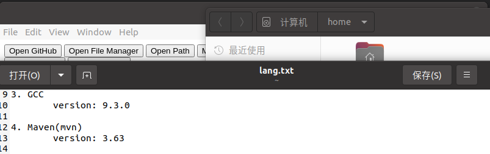
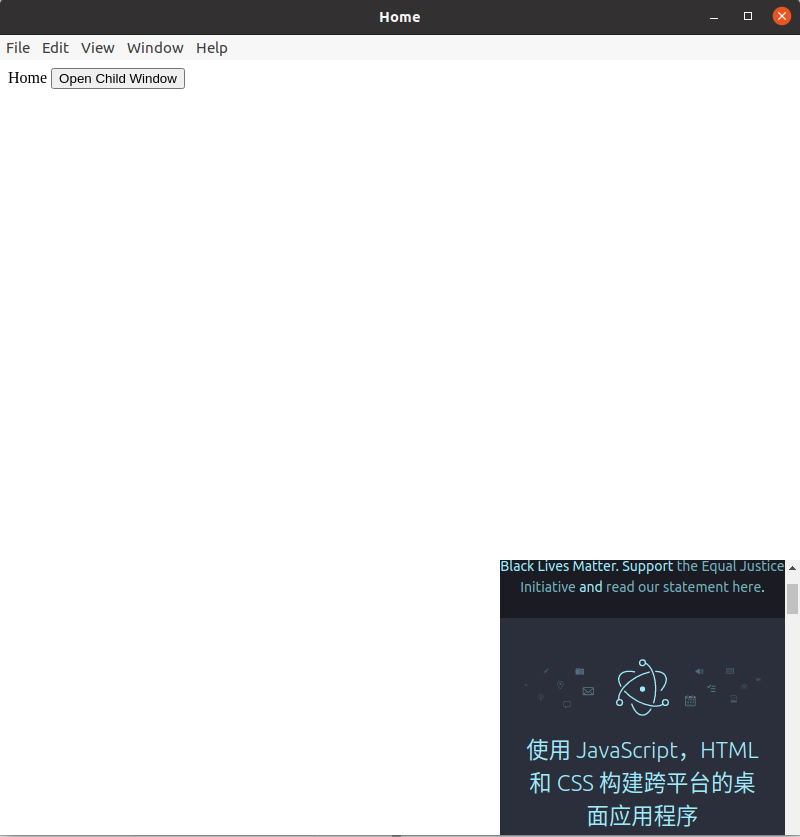

# Electron By Jater

## Install
```
1. install nodejs

2. install npm

3. install electron

   Global install(best way)

   1. linux:

      sudo npm install electron -g --unsafe-perm=true --allow-root

   2. window:

      npm install electron -g

4. Check 

   npx electron -v
```


##### Failed Read this:

- ```
  Electron failed to install correctly, please delete node_modules/electron and try installing again
  	at getElectronPath (xxxxx\node_modules\electron\index.js:14:11)
  option one: 
  	1. going to https://npm.taobao.org/mirrors/electron/
  	2. choose the version and system type
  	3. download the 'electron-<version>-<system_type>.zip'
  	4. going to the global address 'node_modules\electron\'
  	5. create folder 'dist'
  	6. push zip file into 'dist'
  	7. create file 'path.txt' on 'node_modules\electron\', write down 'electron.exe(windows)/electron(linux)'
  	
  option two:
  	1. goting to global address 'node_modules\electron\node_modules\@electron\get\dist\cjs'
  	2. open file 'index.js'
  	3. ctrl + F search "getArtifactRemoteURL"
  	4. replace 'url = artifact_utils_1.getArtifactRemoteURL(artifactDetails);' to 'url ="https://npm.taobao.org/mirrors/electron/<version>/electron-<version><system_type>.zip";'
  ```


------
------


## "Hello World"
##### Code
``` html
<!-- index.html -->
<!DOCTYPE html>
<html lang="en">
<head>
    <meta charset="UTF-8">
    <meta name="viewport" content="width=device-width, initial-scale=1.0">
    <title>Hello World</title>
</head>
<body>
    Hello World
</body>
</html>
```

``` javascript
// main.js
var electron = require('electron')

var app = electron.app
var BrowserWindow = electron.BrowserWindow
var mainWindow = null

app.on('ready', () => {
    mainWindow = new BrowserWindow({width: 800, height: 800})
    mainWindow.loadFile('index.html')
    mainWindow.on('close', () => {
        mainWindos = null
    })
})
```

##### How to Run
```
1. npm init -y
2. electron .
```

##### View


-----
-----


## Operational Process
##### Description


```json
1. read the entry file in package.json
{
  "name": "ElectronDemo03_Remote",
  "version": "1.0.0",
  "description": "",
  "main": "main.js", // here is the entry file
  "scripts": {
    "test": "echo \"Error: no test specified\" && exit 1"
  },
  "keywords": [],
  "author": "",
  "license": "ISC"
}
2. create the renderer process in the main.js main process
3. read the layout and style of the application page
4. Use 'IPC' to perform tasks and retrieve information in the main process
```


-----

-----


## What is IPC

##### Description
- IPC means Inter-Process Communication, It's called ''进程间通信'' in Chinese
- The transfer of data or signals between at least two processes or threads

##### Why Use IPC

- Information sharing:  Web servers that share Web files and multimedia using IPC by Web browsers
- Acceleration: Wiki uses multiple servers that communicate by IPC to meet user requests
- Modular
- Separation of private rights


-----

-----


## Main Process and Renderer Process

##### Description

- We can understand that the entry file defined in "Package.json" is the main process. In general, a program has only one main process, but we can use a main process to open multiple child Windows.

- Since Electron uses Chromium to display Web pages, Chromium's multi-process architecture is used as well. Each Web Page in Electron runs in its own renderer process, which we refer to as the render process

- This means that the main process controls the renderer process, and a single main process can control multiple renderers.


- If you really don't understand it, it doesn't matter, you can simply treat main.js as the main process, and the HTML we wrote as the renderer, It's not rigorous, but it's easy for us to remember lol

##### Demo Code

``` javascript
main.js 
add the BrowserWindow attribute webPreferences
var electron = require('electron')
var app = electron.app
var BrowserWindow = electron.BrowserWindow
var mainWindow = null

app.on('ready', () => { // action 'ready'
    mainWindow = new BrowserWindow({
        width: 800, 
        height: 800,
        webPreferences: {
            nodeIntegration: true // Everything in Node is available in the renderer process
        }
    }) // set up browser window
    mainWindow.loadFile('index.html') // load index.html
    mainWindow.on('close', () => { // action 'close'
        mainWindow = null // reset main window
    })
})
```

``` html
index.html
<body>
    <Button id="btn">My Skills</Button>
    <div id="skills"></div>
    <script src="render/index.js"></script> <!--The entrance of renderer process-->
</body>
```

``` js
render/index.js
var fs = require('fs')
// Renderer Process
// The Native JS
window.onload = function() {
    var btn = this.document.querySelector('#btn')
    var skills = this.document.querySelector('#skills')
    btn.onclick = function() {
        fs.readFile('message.txt', (err, data) => { // message.txt, write what u like lol
            skills.innerHTML = data
        })
    }
}
```


-----

-----


## Remote Module

##### Description

Once we know that Electron has main process and renderer process, one more thing to know about Electron is that its API and modules can also be uses in both the main process and the renderer process. Then if we want to use the method in the main process in renderer process. we can use Electron Remote to solve the IPC between the renderer and the main process

##### Demo Code

``` js
main.js
var electron = require('electron')

var app = electron.app
var BrowserWindow = electron.BrowserWindow
var mainWindow = null

app.on('ready', () => { // action 'ready'
    mainWindow = new BrowserWindow({
        width: 800, 
        height: 800,
        webPreferences: {
            nodeIntegration: true, 
            enableRemoteModule: true // let remote module useful
        }
    }) // set up browser window
    mainWindow.loadFile('index.html') // load index.html
    mainWindow.on('close', () => { // action 'close'
        mainWindow = null // reset main window to close
    })
})
```

``` html
index.html
<body>
    <button id="btn">Open new Page</button>
    <button id="btn02">Open new Myself</button>
    <script src="render/index.js"></script>
</body>
```

``` js
render/index.js
const btn = this.document.querySelector("#btn")
const btn02 = this.document.querySelector("#btn02")
const BrowserWindow = require('electron').remote.BrowserWindow // electron remote module

window.onload = () => {
    btn.onclick = () => {
        newWin = new BrowserWindow({
            width: 500,
            height: 500
        })
        newWin.loadFile('yellow.html')
        newWin.on('close', () => {
            newWin = null
        })
    }
    btn02.onclick = () => {
        var newWin = new BrowserWindow({
            width: 500,
            height: 500,webPreferences: {
                nodeIntegration: true, 
                enableRemoteModule: true
            }
        })
        newWin.loadFile('index.html')
        newWin.on('close', () => {
            newWin = null
        })
    }
}
```

``` html
yellow.html
<body style="background-color: yellow;">
    <h1>BugYellow</h1>
</body>
```


-----
-----


## Menu Module

##### How to implement menu

- To write the menu in Electron, we need to first create a template, which is very similar to our JSON or class arrays

- so we need to implement the menu template

``` js
main/menu.js
const {Menu, BrowserWindow} = require('electron')

var template = [
    {
        label: 'JaterSkill',
        submenu: [
            {
                label: 'Java',
                accelerator: 'ctrl + n', // implement shortcut
                click: () => { // make this label clickable
                    var win = new BrowserWindow({ // jump interface
                        width: 500,
                        height: 500, 
                        webPerferences: {nodeIntegration: true}
                    })
                    win.loadFile('java.html')
                    win.on('close', () => {
                        win = null
                    })
                }
            },
            {label: 'JavaScript'}
        ]
    }, 
    {
        label: 'Sport',
        submenu: [
            {label: 'football'},
            {label: 'basketball'}
        ]
    }
]
var m = Menu.buildFromTemplate(template)
Menu.setApplicationMenu(m)
```

- Then open the main process main.js and add the following code directly in the 'ready' to implement the custom menu

``` js
main.js
require("./main/menu.js")
```



- PS: Menu is a module under the main process, so it can only be used in the main process. remember this.

Electron provides built-int menu parameters that can be used to implement the same menu elements as native ones, such as 'undo' and 'redo', which you can view from the official documentation:https://www.electronjs.org/docs/api/menu


##### What different about MacOS

because MacOS is different from Windows and Linux Menu Settings, set Menu as Application menu on MacOS, and the first item in MacOS is the name of the Application.

If you set the custom menu element in the  first item, it will be overwritten


-----

_____


## How to implement shortcut

eh, one thing is the shortcut key is native to Electron, it's just bound to a custom label, and I'll learn how to implement a custom shortcut property in the future, okay? 

``` js
accelerator: 'ctrl + c'
```


-----

-----


## How to implement Right-Click Menu

##### Description

- Since the Right-Click action occurs in the renderer process, we need to write the Right-Click Menu Template in the renderer process

##### Demo Code

- for this demo the renderer process is index.html(simply means)

``` js
render/index_RightClick.js
const {remote} = require('electron') // Since Right-Click Menu are working with the renderer process, we need to introduce the remote module
var rightClick = [
    {
        label: 'Paste',
        accelerator: 'ctrl + v' // make shortcut key
    },
    {
        label: 'Copy',
        accelerator: 'ctrl + c'
    }
]

var menu = remote.Menu.buildFromTemplate(rightClick)

window.addEventListener('contextmenu', function(e) {
    e.preventDefault() // Prevents the current window default event
    menu.popup({window:remote.getCurrentWindow()}) // adds the menu template to the Right-Click Menu
})
```

- then we write this line into index.js

``` js
render/index.js
require("./render/index_rightClick")
```


-----
-----


## Open DevTools in the code

- Because DevTools can't be used when we use custom menu, we need to turn it on manually in the code

``` js
mainWindow.webContents.openDevTools()
```




_____

_____


## Shell Module

##### Description

- Manage files and URLs using their default applications.


##### Note

- While the 'Shell' module can be used in the renderer process, it will not function in a sandboxed renderer


##### An example of opening a URL in the user's default browser

- shell.openExternal("href")

``` js
render/index.js
const {shell} = require('electron')
var btn = document.querySelector('#btn')
var aHerf = document.querySelector('#aHref')

/**
 * shell.openExternal(url[, options])
 * - url: string - Max 2081 characters on windows
 * - options: Objects
 *      - [macOS]activate: Boolean(optional) - "true" to bring the opened application to the forground. Default true
 *      - [Windows]workingDirectory: String(optional) - The working directory
 * Open the given external protocol in the desktop's default manner.(For example, mailto: URLs in the user's default mail agent)
 */
btn.onclick = (e) => {
    e.preventDefault()
    var href = aHerf.getAttribute('href')
    shell.openExternal(href) // opening a URL in the user's default browser
}
```




##### An example of actions to specified files/folders

```js
render/index.js
/**
 * show the entry item in a File manager. If possible, select the file
 * like address "/home/jater", so show the folder 'jater' in the File Manager
 */
btn02.onclick = (e) => {
    e.preventDefault()
    shell.showItemInFolder("/home/jater")
}

/**
 * Opens the given file in the desktop default manner
 */
btn03.onclick = (e) => {
    e.preventDefault()
    shell.openPath("/home/jater/lang.txt")
}

/**
 * move the given file to trash and returns a boolean status for the operation
 * shell.moveItemToTrash(fullPath[, deleteOnFail])
 * - fullPath: String
 * - [macOS] deleteOnFail: Boolean(optional) - whether or not to unilaterally remove the item if the Trash is disabled or unsupported on the volume
 */
btn04.onclick = (e) => {
    e.preventDefault()
    shell.moveItemToTrash("/home/jater/Workspaces/ElectronProjects/ElectronDemo07_Shell/message.txt")
}
```




##### others example of shell module

``` js
/**
 * Play the beep sound, but i can't hear anything lol 
 */
btn05.onclick = (e) => {
    e.preventDefault()
    shell.beep()
}

/**
 * This api working for Windows System
 * Creates and updates a shortcut link at 'shortcutPath'
 * [Windows]shell.writeShortcutLink(shortcutPath[, operation], options)
 * - shortcutPath: String
 * - operation: String(optional) - Default is 'create', can be one of following:
 *      - create - creates a new shortcut, overwriting if necessary
 *      - update - Updates specified properties only an existing shortcut
 *      - replace - Overwrites an existing shortcut, fails if the shortcut doesn't exist
 * - options: ShortcutDetails
 */
btn06.onclick = (e) => {
    e.preventDefault()
    shell.writeShortcutLink("/home/jater/zzz.txt", "create")
}

/**
 * Resolves the shortcut link at 'shortcutPath'
 */
btn07.onclick = (e) => {
    e.preventDefault()
    var readsc = shell.readShortcutLink("/home/jater/zzz.txt")
    console.log(readsc)
}
```


-----

-----


## BrowserView Class

##### Description

A 'BrowserView' can be used to embed additional web content into a 'BrowserWindow'. It is like a child window, except that it is positioned relative to its owning window. It is meant to be an alternative to the 'webview' tag


##### new BrowserView([options])

- options: Object(optional)
  - webPreferences: Object(optional) - same with BrowserWindows


##### Instance Properties

Objects created with 'new BrowserView' have the following properties

- '**view.webContents**'  *Experimental*
  A 'WebContents' Object owned by this view


##### Instance Method

1. **view.setAutoResize(options)**  *Experimental*

   - *optional*: Object
     - *width*: Boolean(optional) - If true, the view's width will grow and shrink together with the window, false by default
     - *height*: Boolean(optional) - If true, the view's height will grow and shrink together with the window, false by default
     - *horizontal*: Boolean(optional) - If true, the view's x position and width grow and shrink proportionally with the window, false by default
     - *vertical*: Boolean(optional) - If true, the view's y position and height grow and shrink proportionally with the window, false by default

2. **view.setBound(bounds)**  *Experimental*

   - bounds: Rectangle

   Resizes and moves the view to the supplied bounds relative to the view

3. **view.getBounds()**  *Experimental*

   - Returns: Rectangle

   The bounds of this BrowserView instance as object

4. **view.setBackgroundColor(color)**  *Experimental*

   - *color:* String - Color in #aarrggbb or #argb from. The alpha channel is optional


##### Demo Code

``` js
main.js
const {BrowserView, BrowserWindow, app} = require('electron')

app.on('ready', () => {
    const win = new BrowserWindow({
        width: 800,
        height: 800,
        webPreferences: {
            nodeIntegration: true
        }
    })
    
    const view = new BrowserView({
        webPreferences: {
            nodeIntegration: true
        }
    })
    
    win.setBrowserView(view)
    view.setAutoResize({width: true, height: true, horizontal: false, vertical: true})
    view.setBounds({x: 500, y: 500, width: 300, height: 300})
    view.webContents.loadURL('https://electronjs.org')
    win.loadFile('index.html')
})
```




-----

-----


## Window.open Function

##### Description

