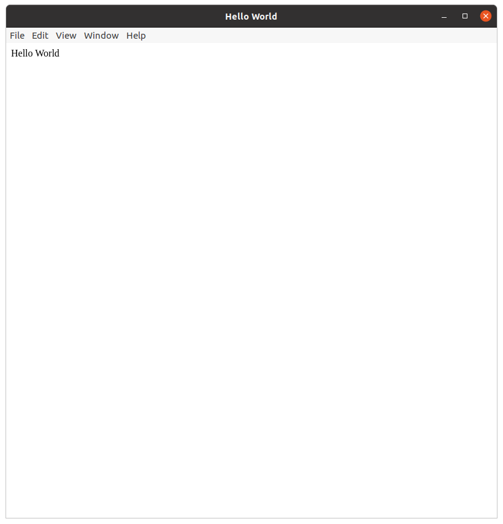
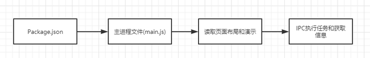
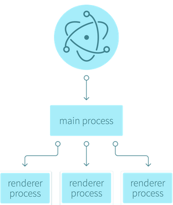
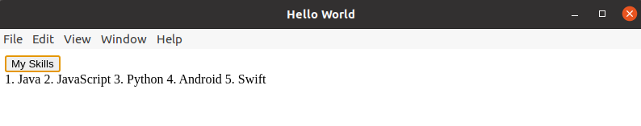
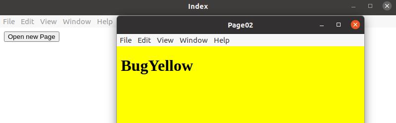

# Electron By Jater

## Install
```
1. install nodejs

2. install npm

3. install electron

   Global install(best way)

   1. linux:

      sudo npm install electron -g --unsafe-perm=true --allow-root

   2. window:

      npm install electron -g

4. Check 

   npx electron -v
```


##### Failed Read this:

- ```
  Electron failed to install correctly, please delete node_modules/electron and try installing again
  	at getElectronPath (xxxxx\node_modules\electron\index.js:14:11)
  option one: 
  	1. going to https://npm.taobao.org/mirrors/electron/
  	2. choose the version and system type
  	3. download the 'electron-<version>-<system_type>.zip'
  	4. going to the global address 'node_modules\electron\'
  	5. create folder 'dist'
  	6. push zip file into 'dist'
  	7. create file 'path.txt' on 'node_modules\electron\', write down 'electron.exe(windows)/electron(linux)'
  	
  option two:
  	1. goting to global address 'node_modules\electron\node_modules\@electron\get\dist\cjs'
  	2. open file 'index.js'
  	3. ctrl + F search "getArtifactRemoteURL"
  	4. replace 'url = artifact_utils_1.getArtifactRemoteURL(artifactDetails);' to 'url ="https://npm.taobao.org/mirrors/electron/<version>/electron-<version><system_type>.zip";'
  ```


------
------


## "Hello World"
##### Code
``` html
<!-- index.html -->
<!DOCTYPE html>
<html lang="en">
<head>
    <meta charset="UTF-8">
    <meta name="viewport" content="width=device-width, initial-scale=1.0">
    <title>Hello World</title>
</head>
<body>
    Hello World
</body>
</html>
```

``` javascript
// main.js
var electron = require('electron')

var app = electron.app
var BrowserWindow = electron.BrowserWindow
var mainWindow = null

app.on('ready', () => {
    mainWindow = new BrowserWindow({width: 800, height: 800})
    mainWindow.loadFile('index.html')
    mainWindow.on('close', () => {
        mainWindos = null
    })
})
```

##### How to Run
```
1. npm init -y
2. electron .
```

##### View


-----
-----


## Operational Process
##### Description


```json
1. read the entry file in package.json
{
  "name": "ElectronDemo03_Remote",
  "version": "1.0.0",
  "description": "",
  "main": "main.js", // here is the entry file
  "scripts": {
    "test": "echo \"Error: no test specified\" && exit 1"
  },
  "keywords": [],
  "author": "",
  "license": "ISC"
}
2. create the renderer process in the main.js main process
3. read the layout and style of the application page
4. Use 'IPC' to perform tasks and retrieve information in the main process
```


-----

-----


## What is IPC

##### Description
- IPC means Inter-Process Communication, It's called ''进程间通信'' in Chinese
- The transfer of data or signals between at least two processes or threads

##### Why Use IPC

- Information sharing:  Web servers that share Web files and multimedia using IPC by Web browsers
- Acceleration: Wiki uses multiple servers that communicate by IPC to meet user requests
- Modular
- Separation of private rights


-----

-----


## Main Process and Renderer Process

##### Description

- We can understand that the entry file defined in "Package.json" is the main process. In general, a program has only one main process, but we can use a main process to open multiple child Windows.

- Since Electron uses Chromium to display Web pages, Chromium's multi-process architecture is used as well. Each Web Page in Electron runs in its own renderer process, which we refer to as the render process

- This means that the main process controls the renderer process, and a single main process can control multiple renderers.



- If you really don't understand it, it doesn't matter, you can simply treat main.js as the main process, and the HTML we wrote as the renderer, It's not rigorous, but it's easy for us to remember lol

##### Demo Code

``` javascript
main.js 
add the BrowserWindow attribute webPreferences
var electron = require('electron')
var app = electron.app
var BrowserWindow = electron.BrowserWindow
var mainWindow = null

app.on('ready', () => { // action 'ready'
    mainWindow = new BrowserWindow({
        width: 800, 
        height: 800,
        webPreferences: {
            nodeIntegration: true // Everything in Node is available in the renderer process
        }
    }) // set up browser window
    mainWindow.loadFile('index.html') // load index.html
    mainWindow.on('close', () => { // action 'close'
        mainWindow = null // reset main window
    })
})
```

``` html
index.html
<body>
    <Button id="btn">My Skills</Button>
    <div id="skills"></div>
    <script src="render/index.js"></script> <!--The entrance of renderer process-->
</body>
```

``` js
render/index.js
var fs = require('fs')
// Renderer Process
// The Native JS
window.onload = function() {
    var btn = this.document.querySelector('#btn')
    var skills = this.document.querySelector('#skills')
    btn.onclick = function() {
        fs.readFile('message.txt', (err, data) => { // message.txt, write what u like lol
            skills.innerHTML = data
        })
    }
}
```


-----

-----


## Remote Module

##### Description

Once we know that Electron has main process and renderer process, one more thing to know about Electron is that its API and modules can also be uses in both the main process and the renderer process. Then if we want to use the method in the main process in renderer process. we can use Electron Remote to solve the IPC between the renderer and the main process

##### Demo Code

``` js
main.js
var electron = require('electron')

var app = electron.app
var BrowserWindow = electron.BrowserWindow
var mainWindow = null

app.on('ready', () => { // action 'ready'
    mainWindow = new BrowserWindow({
        width: 800, 
        height: 800,
        webPreferences: {
            nodeIntegration: true, 
            enableRemoteModule: true // let remote module useful
        }
    }) // set up browser window
    mainWindow.loadFile('index.html') // load index.html
    mainWindow.on('close', () => { // action 'close'
        mainWindow = null // reset main window to close
    })
})
```

``` html
index.html
<body>
    <button id="btn">Open new Page</button>
    <script src="render/index.js"></script>
</body>
```

``` js
render/index.js
const btn = this.document.querySelector("#btn")
const BrowserWindow = require('electron').remote.BrowserWindow // electron remote module

window.onload = () => {
    btn.onclick = () => {
        newWin = new BrowserWindow({
            width: 500,
            heoght: 500
        })
        newWin.loadFile('yellow.html')
        newWin.on('close', () => {
            newWin = null
        })
    }
}
```

``` html
yellow.html
<body style="background-color: yellow;">
    <h1>BugYellow</h1>
</body>
```

